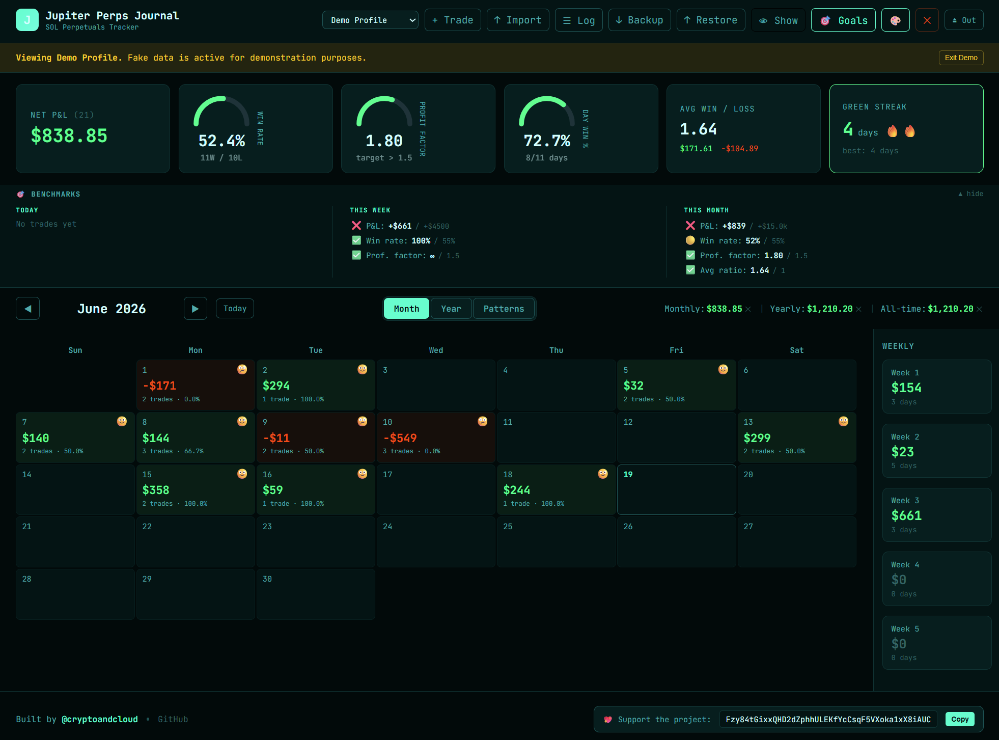
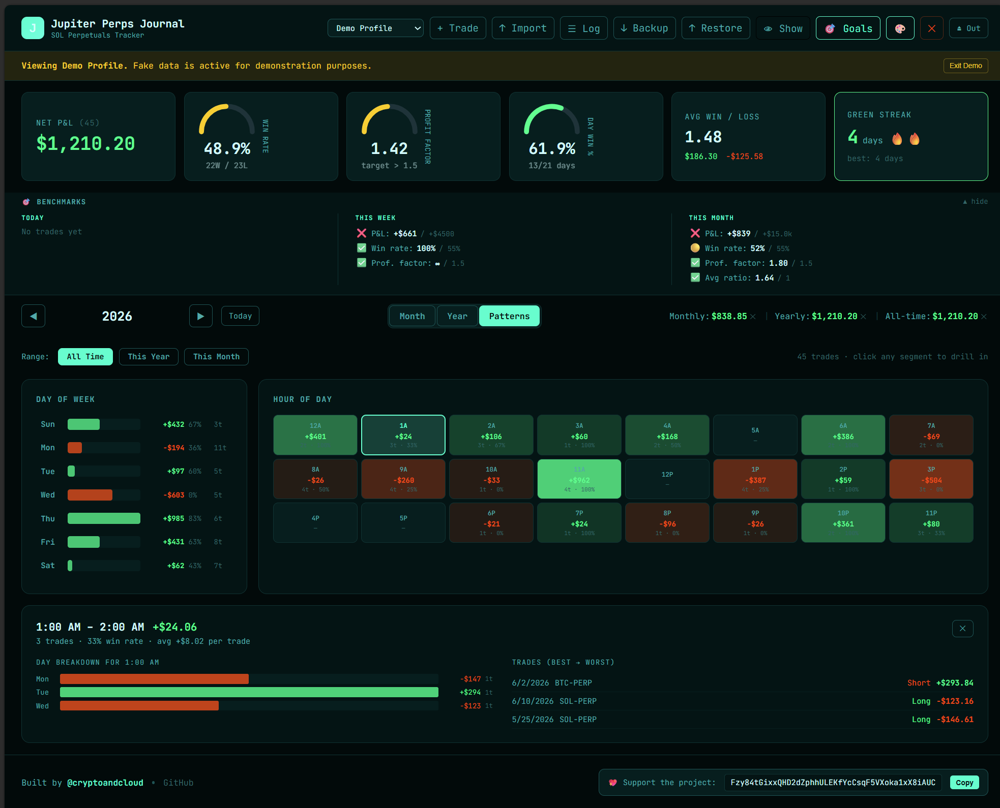

# Jupiter Perps Trading Journal


A free, local, open-source TradeZella-style dashboard for tracking your Jupiter.ag perpetuals trades.

Built by **Crypto in Cloud**. 

**Connect with me:**
- 👻 **Phantom:** [@cryptoandcloud](https://phantom.com/user/cryptoandcloud)
- 📺 **YouTube:** [PromptAndFlow](https://www.youtube.com/@PromptAndFlow) - Check out my channel for deep dives into AI and automation!

---

## 💖 Support & Donate

If this free tool helps you secure the bag, consider supporting its development! 

**Solana Donation Address:**
```
Fzy84tGixxQHD2dZphhULEKfYcCsqF5VXoka1xX8iAUC
```

---

## 📸 Screenshots


---


---

## Quick Setup (5 minutes)

### 1. Install Node.js (if you don't have it)
Download from: https://nodejs.org (LTS version)

### 2. Set up the project
Open a terminal / PowerShell and run:

```bash
cd jupiter-perps-journal
npm install
npm run dev
```

That's it. Opens at **http://localhost:3000** in your browser.

### 3. Daily workflow
1. Go to Jupiter.ag → Trade History → Export CSV
2. Open journal at localhost:3000
3. Click "↑ Import" and drop the CSV
4. Duplicates are automatically detected and skipped — safe to reimport the full history every time

> [!WARNING]
> **Important Note:** For the best experience and most accurate data (including full pattern and metric support), **always use the CSV export method**. While wallet import via address/API is available, on-chain indexing may miss certain trade attributes or historical data, resulting in incomplete pattern features.

## How It Works

- **Zero cost** — runs entirely on your machine, no server, no subscription
- **Data stays local** — stored in your browser's localStorage (persists across restarts)
- **Built-in Demo Profile** — Want to test it out? Select "Demo Profile" from the top dropdown to see the dashboard populated with 45 realistic, generated trades.
- **Duplicate detection** — fingerprints each trade using date + PnL + market + side + size + entry + exit + fees + leverage, so reimporting the same CSV adds nothing
- **Backup** — click "↓ Backup" to export a JSON file of all your trades

## Hosting Options (if you want it online)

| Option | Cost | How |
|--------|------|-----|
| **Local only** | Free | `npm run dev` on your machine |
| **Vercel** | Free | Push to GitHub → connect to vercel.com → auto-deploys |
| **Netlify** | Free | Push to GitHub → connect to netlify.com → auto-deploys |
| **GitHub Pages** | Free | `npm run build` → deploy `dist/` folder |

For Vercel/Netlify, your data still stays in your browser (localStorage).

## Building for Production

```bash
npm run build
```

Creates a `dist/` folder with static files you can host anywhere (or just open `dist/index.html`).

## Contributing

We welcome contributions! If you have ideas for new metrics, UI improvements, or API integrations (like Helius), feel free to open an issue or submit a Pull Request.

---

## Jupiter CSV Format

The parser auto-detects columns from Jupiter exports. It looks for:
- **P&L**: pnl, p&l, profit, realized pnl, net pnl, profit/loss
- **Date**: close time, closed at, date, timestamp, exit time
- **Side**: side, direction, type, position
- **Market**: market, token, symbol, pair, asset
- **Size**: size, amount, quantity, notional, position size
- **Leverage**: leverage, lev
- **Entry/Exit**: entry price, open price, exit price, close price, mark price
- **Fees**: fee, fees, total fees, trading fee
- **Collateral**: collateral, margin, initial margin
